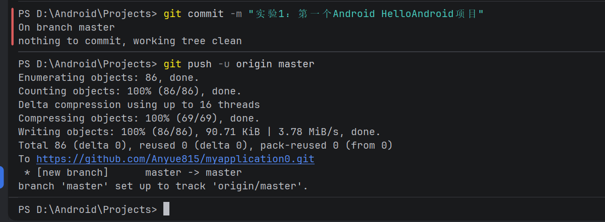
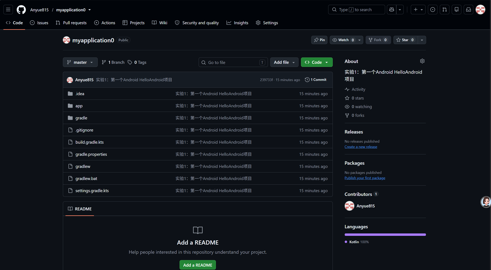
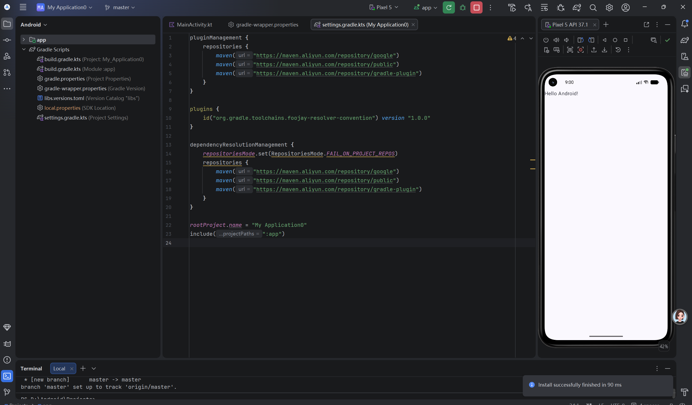

# 实验报告：Android Studio 创建 HelloAndroid 项目 + Git 推送到 GitHub

## 一、实验目的

1. 掌握 Android Studio 的安装与基本使用方法，熟悉其项目结构。
2. 学会使用 Android Studio 创建一个新的 Android 项目 HelloAndroid。
3. 了解 Android 项目中各目录与文件的作用，能够运行第一个 Android 应用。
4. 掌握 Git 版本控制工具的基本操作，包括本地仓库初始化、远程仓库关联、提交与推送。
5. 能够将本地 Android 项目推送到 GitHub 远程仓库，实现代码的云端备份与协作管理。

## 二、实验环境

- 操作系统：Windows 
- 开发工具：Android Studio 
- JDK 版本：JDK 17
- Android SDK：API 34 
- 编程语言：Java / Kotlin
- 版本控制工具：Git for Windows
- 远程代码托管平台：GitHub
- 测试设备：Android 模拟器 

## 三、实验内容

1. 使用Android Studio新建Empty Activity空白Android项目，项目名称为myapplication0。
2. 运行项目，在模拟器上预览Hello Android界面效果。
3. 使用Git初始化本地仓库，关联GitHub远程仓库地址。
4. 将项目文件加入暂存区，执行本地提交，推送代码至GitHub远程仓库。
5. 访问GitHub网页，验证代码是否成功上传。

## 四、实验步骤

### 1. 创建 Android 项目

打开 Android Studio，新建 Empty Activity 空白项目，项目名称设置为 myapplication0，编程语言选择 Kotlin，配置合适的 SDK 版本，完成项目创建。构建项目，确认项目无编译报错。

### 2. Git 本地仓库初始化与代码推送

打开 PowerShell 终端，进入项目根目录 `D:\Android\Projects`，依次执行下面 Git 命令。

初始化本地 Git 仓库：

```powershell
git init
```

关联远程 GitHub 仓库：

```powershell
git remote add origin https://github.com/Anyue815/myapplication0.git
```

将所有项目文件加入暂存区：

```powershell
git add .
```

将暂存区代码提交到本地仓库，填写提交说明：

```powershell
git commit -m "实验1：第一个Android HelloAndroid项目"
```

将本地 master 分支推送到远程 GitHub 仓库：

```powershell
git push -u origin master
```

### 3. GitHub 网页端验证

浏览器访问仓库地址：`https://github.com/Anyue815/myapplication0`，刷新页面，查看仓库内项目文件，确认 `app`、`gradle` 等目录全部上传成功。

## 五、实验结果

1. Android项目构建成功，模拟器正常启动并展示Hello Android页面。
2. Git命令执行无误，项目代码成功推送到GitHub远程仓库。
3. GitHub仓库存在1次提交记录，当前分支为master，仓库内可查看完整项目源码。

## 六、实验总结与问题分析

1. 通过本次实验，掌握Android Studio新建项目流程，熟悉`git init`、`git add`、`git commit`、`git push`基础Git命令，完成代码托管到GitHub的完整流程。
2. 遇到问题：执行`git push -u origin main`时提示`src refspec main does not match any`。
    - 原因：本地Git初始化默认生成分支master，不存在main分支。
    - 解决方案：改为推送master分支，执行`git push -u origin master`。
3. 本次提交包含`.idea`文件夹，该文件夹为Android Studio IDE配置文件，正式项目开发应在`.gitignore`中忽略该目录，避免上传无关配置。
4. Windows环境Git提示LF/CRLF换行警告，属于系统换行符自动转换，不会影响项目代码运行。

## 七、截图说明

### 图1 Git push推送成功终端截图



### 图2 GitHub仓库主页截图



### 图3 Android模拟器运行HelloAndroid界面

